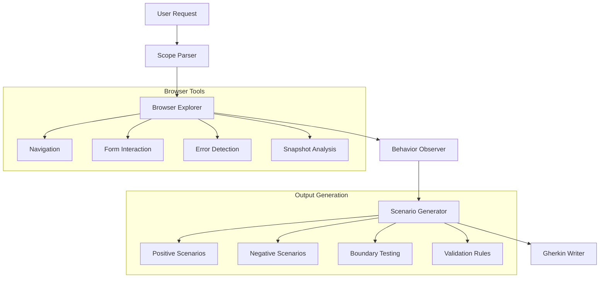

# Playwright Gherkin Planner Agent

## Overview

The **Playwright Gherkin Planner Agent** is a specialized AI-powered testing agent that combines the power of Playwright browser automation with BDD (Behavior Driven Development) test scenario generation. This agent represents a breakthrough in automated test design, enabling quality engineers to systematically discover and document both positive user flows and negative edge cases through guided web application exploration.

## Purpose & Mission

The agent's primary mission is to **explore specific web application features and generate comprehensive test scenarios in Gherkin format**. The scenario type (positive, negative, or both) is determined by user instructions in chat. Unlike traditional testing approaches that rely on assumptions or manual exploration, this agent interacts directly with live web applications to observe actual behavior and create test scenarios based on empirical evidence.

### Core Objectives

- **Evidence-Based Test Design**: Generate test scenarios strictly based on observed browser behavior, not assumptions
- **Comprehensive Test Coverage**: Systematically explore happy paths, edge cases, boundary conditions, and failure scenarios based on user requirements
- **Flexible Scenario Generation**: Support positive (happy path), negative (edge cases), or comprehensive (both) testing approaches
- **BDD Documentation**: Produce well-structured, maintainable Gherkin feature files that serve as both tests and documentation
- **Quality Assurance**: Ensure applications handle valid inputs correctly and invalid inputs gracefully with meaningful error messages

## Concept & Architecture

### Hybrid AI-Browser Architecture

The agent employs a unique **hybrid architecture** that combines:

1. **AI Intelligence**: Claude Sonnet 4 model for intelligent decision-making and scenario generation
2. **Browser Automation**: Playwright MCP (Model Context Protocol) server for real-time web interaction
3. **BDD Framework**: Structured Gherkin output following industry-standard patterns

### Core Components



## Workflow

### Phase 1: Scope Analysis & Setup
1. **Parse User Requirements**: Extract specific feature scope, entry points, and focus areas from user instructions
2. **Initialize Browser Environment**: Set up clean testing environment using `planner_setup_page`
3. **Navigate to Target**: Reach the specified application feature or functionality

### Phase 2: Systematic Exploration
1. **Visual Inspection**: Capture page snapshots to understand UI structure and elements
2. **Interactive Exploration**: 
   - For positive scenarios: Test valid data patterns and successful user flows
   - For negative scenarios: Fill forms with invalid data and test error conditions
   - Test each form field independently based on scenario type
   - Submit complete, incomplete, or malformed data as appropriate
   - Observe system responses to various input conditions

### Phase 3: Behavior Documentation
1. **Response Capture**: Record exact success messages, error messages, and validation responses
2. **Behavior Pattern Analysis**: Identify consistent validation rules, success flows, and error patterns
3. **Comprehensive Discovery**: Uncover positive user flows, edge cases, and validation behaviors

### Phase 4: Scenario Generation
1. **Gherkin Structure Creation**: Design scenarios following BDD best practices
2. **Data-Driven Testing**: Create Scenario Outlines with Examples tables for comprehensive coverage
3. **Tag Application**: Apply appropriate feature and priority tags

### Phase 5: Output & Documentation
1. **Feature File Generation**: Create structured `.feature` files in `features/_review/` directory
2. **Quality Assurance**: Ensure all scenarios are independent and executable
3. **Summary Reporting**: Provide insights on discovered issues and test coverage

## Key Benefits

### 1. **Automated Discovery of Edge Cases**
Traditional testing often misses subtle edge cases because they're not obvious to human testers. The agent systematically explores boundary conditions, special characters, and unusual input combinations that might be overlooked in manual test design.

### 2. **Evidence-Based Test Scenarios**
Every generated test scenario is based on actual observed behavior rather than assumptions. This ensures that:
- Error messages are exact and current
- Validation rules reflect actual implementation
- Test scenarios remain accurate as the application evolves

### 3. **Consistent Quality Standards**
The agent enforces consistent test design patterns across the entire test suite:
- Standardized Gherkin structure and tagging
- Uniform naming conventions
- Comprehensive coverage patterns

### 4. **Accelerated Test Development**
What traditionally takes hours of manual exploration and documentation can be completed in minutes, allowing QA teams to:
- Cover more features in less time
- Focus on high-value testing activities
- Maintain comprehensive test coverage as applications evolve

### 5. **Living Documentation**
Generated Gherkin files serve dual purposes:
- Executable test specifications
- Human-readable documentation of application behavior and validation rules

### 6. **Reduced Human Error**
Automated exploration eliminates common human errors in test design:
- Forgotten edge cases
- Incorrect error message documentation
- Inconsistent test patterns
- Incomplete coverage

## Integration with AI-Augmented Test Suite

### Seamless Workflow Integration
The agent integrates seamlessly with the broader AI-augmented test ecosystem:

```
User Request → Gherkin Planner → Test Generator → Test Execution → Healing Agent
```

1. **Gherkin Planner**: Generates comprehensive test scenarios
2. **Test Generator**: Converts scenarios to executable Playwright tests
3. **Test Execution**: Runs automated test suite
4. **Healing Agent**: Maintains and fixes tests as application changes

### Quality Assurance Pipeline
The agent contributes to a comprehensive quality pipeline:
- **Feature Files**: Human-readable test documentation
- **Step Definitions**: Reusable test implementation
- **Page Objects**: Maintainable test architecture
- **Test Data**: Factory-generated realistic test data

## Technical Specifications

### Supported Tools & Capabilities
- **Browser Navigation**: Multi-page application exploration
- **Form Interaction**: Input field testing and validation
- **Error Detection**: Automated error message capture
- **Visual Analysis**: Screenshot and snapshot capabilities
- **Network Monitoring**: Request/response analysis
- **Dynamic Content**: Handling of AJAX and SPA applications

### Output Standards
- **File Format**: Gherkin `.feature` files
- **Naming Convention**: `{domain}-{feature-name}-{scenario-type}.feature`
- **Tag Structure**: `@{feature-id} @{domain} @{positive/negative}`
- **Review Process**: Files saved to `features/_review/` for approval

## Best Practices & Recommendations

### Effective Usage Patterns

1. **Feature-Focused Sessions**: Target specific features or user journeys for comprehensive coverage
2. **Iterative Exploration**: Start with high-priority scenarios, then expand to edge cases
3. **Regular Updates**: Re-run exploration when application features change
4. **Team Collaboration**: Use generated scenarios as discussion points for requirement clarification

### Quality Guidelines

- Always start with fresh browser state for accurate exploration
- Focus on one feature at a time for manageable scope
- Validate generated scenarios through team review
- Maintain traceability between business requirements and test scenarios

## Future Enhancements

The playwright-gherkin-planner agent represents the foundation for advanced test automation capabilities:

- **AI-Driven Test Prioritization**: Intelligent selection of high-impact test scenarios
- **Cross-Browser Validation**: Automated detection of browser-specific behaviors
- **Performance Integration**: Negative testing combined with performance impact analysis
- **Accessibility Testing**: Integration with accessibility scanning and validation

## Conclusion

The Playwright Gherkin Planner Agent revolutionizes test scenario generation by combining AI intelligence with systematic browser automation. It transforms the traditionally manual and error-prone process of test discovery into an automated, evidence-based workflow that produces comprehensive, maintainable test documentation. Whether focusing on positive user journeys, negative edge cases, or comprehensive coverage of both, this agent significantly enhances application quality and user experience reliability.